# Scented Candle E-Store Design Documentation

## Team Information
* Team name: 404teamnamenotfound
* Team members
  * Alex B
  * Aiden P
  * Sahima S
  * Jack F
  * Maria W

## Executive Summary
Our E-store offers a variety of uniquely scented candles tailored to meet the preferences of our customers. With the aim to provide an immersive experience, we have developed scents specifically crafted for RIT students, making our website more relatable and engaging. As a customer, one can log into their personal Scented Candles e-store account, browse through a variety of scented candles, choose their favorite ones, and purchase them with a credit card. The backend of the project is coded in Java and uses Spring Boot and REST API principles, while the frontend uses Angular.

### Purpose:
Our project is designed to meet the specific scent preferences of our main users, who are primarily RIT students. By offering scents specifically directed towards this demographic, we seek to enhance the overall user experience and foster a sense of connection and relatability. The primary goal of our project is to provide RIT students with a convenient and enjoyable platform to discover and purchase uniquely scented candles. Our e-store also provides an easy-to use environment for the e-store admin to manage and update the inventory of the e-store to keep the customers engaged with new and exciting scents.
Through intuitive user interfaces, we aim to facilitate seamless interactions for both the customers and the admin, empowering efficient management of the e-store and fostering a loyal customer base.

### Glossary and Acronyms:

| Term | Definition |
|------|------------|
| DAO | Data Access Object |
| ID | Unique identifier for a Candle or a User |
| MVP | Minimal Viable Product |
| CRUD | Create, Read, Update, Delete |
| API | Application Program Interface |
| OO | Object-Oriented |
| UML | Unified Modeling Language |
| REST | Representational State Transfer |
| SOLID | Single Responsibility, Open/Closed, Liskov Substitution, Interface Segregation, Dependency Inversion |
| GRASP | General Responsibility Assignment Software Patterns |
| SPA | Single Page Application |
| MVVM | Model-View-ViewModel |

<!-- SPA is mentioned in the Architecture and Design summary -->

## Requirements

This section describes the major features of the application for both the cuatomers and the admin. The basic features are as follows:

* Login options for customers and an admin account.
* Admin account can update the inventory of the estore.
* Customer accounts have a shopping cart that can be used to carry out purchases.
* A list of products will be available to the users (both customers and the admin) upon logging in.

### Definition of MVP
Our estore has a frontend and backend linked together that can perform the following funtions:
  1. **Authentication**: Our e-store allows for customers and an admin to login to the estore using a username. The username "admin" is reserved for the admin/owner of the e-store, while any other username indicates a customer account. Our e-store goes beyond this minimal authentication by using a password as well as described further in this document.
  2. **Viewing the Catalogue**: Both the customers and the admin can view a list of currently available products in the e-store as the first page when they log into their account.
  3. **Customer Functionality**: When logged in as a customer, one can
    a. search for items on the dashboard 
    b. add or remove a product to/from their shopping cart 
    c. access the details of each product by clicking on it on the Dashboard (Note: The details of each candle inculdes the name, the price and the number of items left in stock.)
    d. Once an item is in their shopping cart, a customer can update the quantity of each product, provided that it is within the range of the available quantity in the inventory.
    e. The customer's shopping cart items persist between login sessions. Thus if a customer adds something to their cart and updates the number of items and then logs out, they can log back in and expect their items to be intact in their shopping cart.
    f. Once in their shopping cart, a customer can proceed to checkout their items for purchase.
  4. **E-store Admin Functionality**: When logged in as an admin, one can add and remove products, as well as edit the details of each product in the inventory of the e-store. These changes are reflected in the catalogue of both the admin and the customer. The admin does not have any access to a shopping cart or credit card information since they make no purchases.

### **MVP Features**
Here is a list of top-level Epics and Stories used in this project:
1. **Epic: Logging in and out:**
    As a user, I want to be able to log in/out of my estore account so that I can access my customized estore account.
    * **Log in as Admin:** As an owner, I want to log in to my e-store with admin access so that I can manage the inventory of my e-store.
    * **Log in as Customer:** As a customer, I want to be able to log into my account so that I can buy products that I have browsed in the e-store.
    * **Logout:** As a user, I want to logout of my account so that I can log into another account and my information is kept private.
2. **Epic: Shopping Cart Functionalities**
    As a customer, I want to be able to manage my shopping cart so that I can purchase the candles that I want
    * **View Shopping Cart:** As a customer, I want to be able to access a shopping cart so that I can continue with my purchases from the e-store.
    * **Add Product to Cart:** As a customer, I want to add an item to the shopping cart so that I can purchase a product.
    * **Remove Product from Cart:** As a customer, I want to remove an item from my cart so that I do not keep an item on hold that I don’t plan on purchasing.
3. **Story: Check Out Products:** As a customer, I want to check out the products in my shopping cart so that I can buy all of the  products that I want at once.
4. **Story: Search for Product:** As a customer, I want to search for a product so that I can find the specific candle scent that I am looking for.
5. **Epic: Managing Inventory**
    As an admin, I want to be able to manage the inventory of my estore so that I can sell new and interesting varieties to my customers
    * **Add Item to Inventory:** As an owner, I want to add a product to the inventory so that customers remain happy and the webpage remains accurate.
    * **Remove Item from Inventory:** As an owner, I want to remove an item that is not being sold so that customers remain happy and the website remains accurate.
    * **Track Product Quantity:** As an owner, I want the product quantity to update when someone has purchased an item so that I can keep track of what is being sold and what is not.
    * **Edit Product Data:** As the owner, I want to update product names, prices, and quantities to maintain accuracy, enabling customers to buy available items.

### **Enhancements**

  1. **Password:** As a customer, I want to create a password with my account so that I can protect my login information.
  
  Admin and customer accounts are each protected by a password that is required while logging in. If the user enters a wrong password, an error message is displayed in red: *"Please check your password."* New users can sign up with a unique username of their choice, provided that it is not already taken by an existing user (the error message for an invalid username is: *"Username is already taken. Please choose a different username."*) The new user must also set their password and make sure that it adheres to the following security requirements:
    
    The password must contain:
    * between 8-32 characters
    * atleast 1 number
    * atleast 1 capital letter
    * atleast 1 lowercase letter
    * atleast one of the following special characters: ! @ # $ % ^ & * + =
  
  &nbsp;&nbsp;&nbsp;&nbsp;&nbsp;&nbsp;&nbsp;&nbsp;For every invalid password the new user tries to generate, an appropriate error message is generated as shown in the snapshot of the website below:

  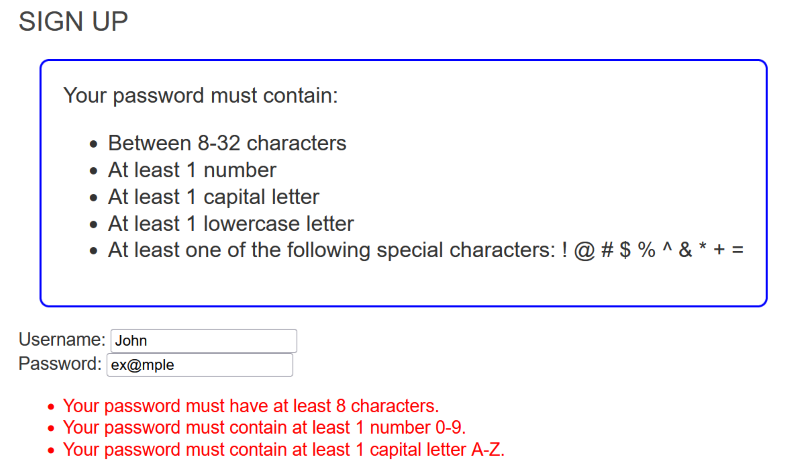
  
  Another important feature of the password login is that if a customer tries to login with an invalid username, they are promptly directed to the Sign-up page for them to make a new account.
 

  2. **Credit Card Information:** As a customer, I want to be able to add a credit card so that I can carry out my purchases.
  
  After adding the items to their cart, a customer can checkout the items by clicking on the "Checkout" button. Here is the checkout page:

  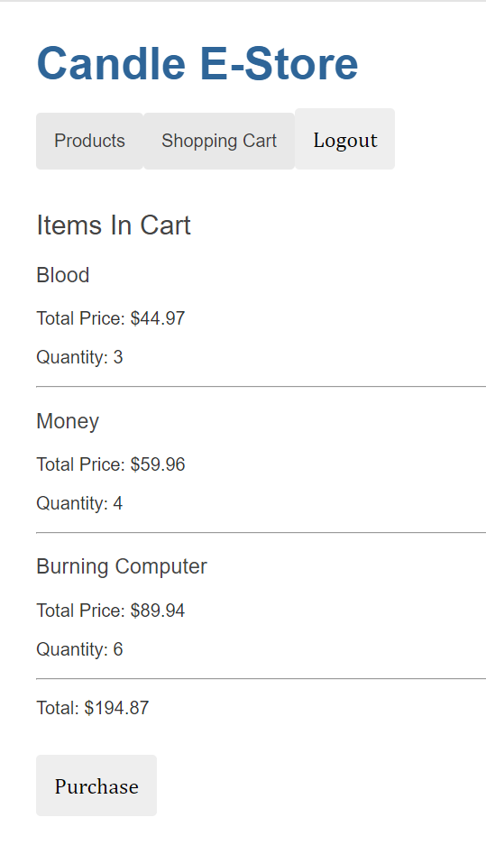
  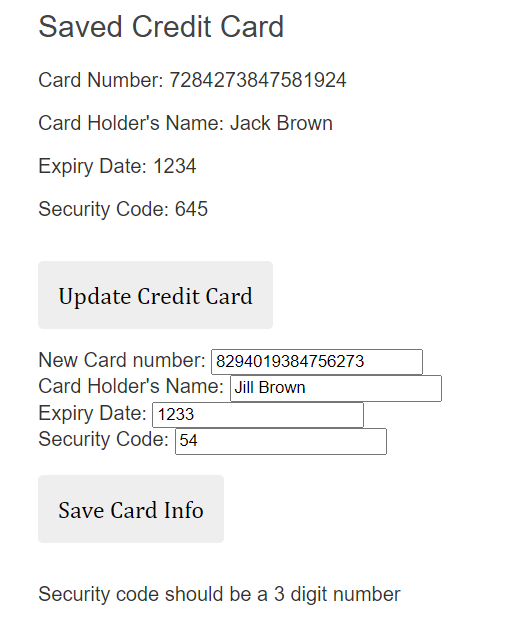

On the checkout page, customers must add and verify credit card information in order to check out their purchases. The fields to be entered include the credit card number, the card holder's name, the expiry date, and the security code. While adding a new credit card, certain requirements must be met. If not, appropriate error messages are displayed. The requirements that need to be met are as follows:

1. The credit card number must be exactly 16 digits.
2. The expiry date must be a 4 digit number with the first two digits being the month and the last 2 digits being the year of expiry.
3. The security code must also be a 3 digit number.

Once all these requirements are met and the customer clicks on the "Save Card Info" button, the "Saved Credit Card" section is updated accordingly. An example of the error message displayed on the entry of an invalid security code is shown in the snapshot of the Checkout page above.

## Application Domain

This section describes the application domain.

  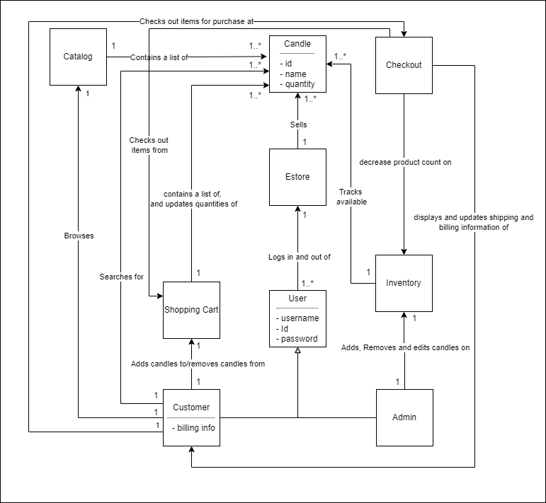

The above Domain Model diagram shows the relationship between the different domain entities of the estore. The main components of the estore are the User (both the Customer and the Admin), the Candle, the Inventory, and the Shopping Cart. A Customer is a user who has a Shopping Cart entity of their own and can add/remove/change the number of Candle entities on this shopping cart, while the Admin is a user who has access to change the content on the Inventory by changing the number of Candles, or adding/deleting Candles from the inventory.
 
 

## Architecture and Design

This section describes the application architecture.

### Summary

The following Tiers/Layers model shows a high-level view of the web app's architecture.

  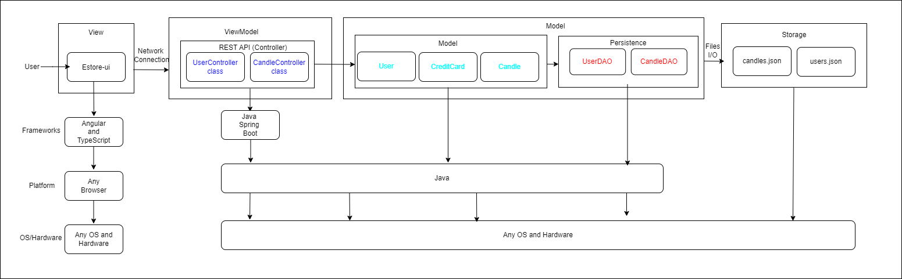

The web application, is built using the *Model–View–ViewModel (MVVM)* architecture pattern. 

The *Model* stores the application data objects including any functionality to provide persistance. 

The *View* is the client-side SPA built with Angular utilizing HTML, CSS and TypeScript. 

The *ViewModel* provides RESTful APIs to the client (View) as well as any logic required to manipulate the data objects from the Model.

Both the ViewModel and Model are built using Java and Spring Framework. Details of the components within these tiers are supplied below.

### Overview of User Interface

This section describes the web interface flow; this is how the user views and interacts with the web application.

* There is a login page for users to enter their login information, using both a username and a password.
* If the user is a customer, they are routed to a catalogue of the available scented candles on the e-store, along with a search bar to help the user navigate through the catalogue with ease.
* The customer can click on the name of any candle to view its details such as its name, price and quantity in stock. They can also add the item to their cart with just the click of a button.
* The customer can easily access their shopping cart via a button which takes them to their shopping cart of items they've added there.
* The customer can increase/decrease the number of items in their shopping cart provided that the number they enter is within stock
* The customer can add a credit card while checking out of their shopping cart and purchase the items they wish to purchase.
* If the user is logged in as an admin, they are brought to a page containing the inventory where they can update product information, or add/remove products as they wish.

 
 

### **View Tier**

<!-- 

  

 -->

The View tier of the project includes code in HTML, CSS, and TypeScript that utilizes the Angular framework of front-end web-development. Each page and major component of the website has been assigned a separate Angular component in the project, which includes HTML, CSS and Typescript code for each. For example, the project has separate Angular components for the login page, the Products page (separate for the customer and admin), the candle-detail page, the shopping cart, etc.
 

The user interface of the project uses simple and clear fonts for each of its pages to make it very easy for the user to interact with the website. The website might not be very fancy and colourful, owing to the lack of time in implementing much of the CSS code, but it utilizes a substantial amount of user-friendliness by including cross-page navigation buttons, or action buttons at strategic and intuitive places on each page (refer to snapshot of the navigation bar in a customer account shown below.) 

  

The first page that the uses sees when the website is run, is the login component page given by the URL localhost:4200/login, where the user can either login to their account using their existing username and password, or create a new account by clicking on the link provided on this page if they are a new user. 

  
  

If the user is a customer, they are routed to the customer's Dashboard/Products page (URL: /user-dashboard) where they can view a unique assortment of available scented candles. They can search for a candle they would like to purchase, using the search bar on the dashboard. Searching for a candle name dynamically shows search results which can be clicked to view the details of the candle. One can also view the candle details by clicking on any of the name tiles on the catalog of the dashboard. The candle detail page (URL: /detail/:id) includes the name, price, and quantity available in stock for each candle. The customer can add a candle to their cart using the "Add to cart" button if it is not already there, provided that the candle is not out of stock. Appropriate error messages are shown as can be seen below:

  
  

With items added to their virtual cart, customers can now proceed to the Shopping Cart Page component (URL: /shopping-cart) by clicking on the appropriate navigation button on the Products page. Here, they can review their selected items, adjust quantities either by using the arrow buttons or by entering the quantity manually, and clicking on the "Update Quantity" button. As long as the quantity is in stock, they can increase the quatity to whatever number they like. The customer also has an option to remove an item from their cart if they no longer want to purchase it. They can then proceed to checkout, knowing their items are securely stored.

  

On arriving at the Checkout Page component (URL: /chekcout), customers follow a streamlined process to finalize their orders. If the customer has a saved credit card, it is displayed on this page. The customer can edit the credit card information if they want to. If they do not have a card saved, they can add one too. Clicking on the "Purchase" button allows them to buy the items in their shopping cart and displays a "Purchase successful" message on the screen.

  
  

In parallel, our website caters to administrators with the Admin's Candles Page component. This specialized interface empowers administrators (the user who logs in using the username "admin") to update the inventory by adding/removing more items, restocking on the present items, and updating the price of these items, facilitating efficient backend operations.

Admin Candles page, ie., the inventory (URL: /candles)

  

 
 

Adding a new product to the inventory:

  
  

Updating an existing candle:

  

Together, these Angular components form the backbone of our e-store's View Tier UI, delivering a captivating and user-centric shopping experience.

#### Specific Front-end Functionalities and Sequence Diagrams

1. **Adding a product to the cart:** In the Customer view, the list of candles available on the estore is shown at the center of the screen, keeping important information in the forefront. This is mainly handled by the user-dashboard component that makes a one-way call to the candle-service class to get the list of candles. The customer can access the details of each of the candles displayed by clicking on the name of the candle. On clicking, a call is made to the candle-detail component class that is responsible for fetching the data associated with that candle and displaying it on the user's screen. The when the user clicks on the "Add to cart" button on this page, the candle-detail component checks whether the candle is already in the user's shopping cart or not. If it is, an error message is displayed: "Product is already in your cart. Please update the quantity in your cart to add more." The Candle detail component also checks whether the inventory is out of stock for this particular candle or not. In case it is out of stock, it displays another error message: "Product is out of stock." If neither of these occur, the product is successfully added to the cart.

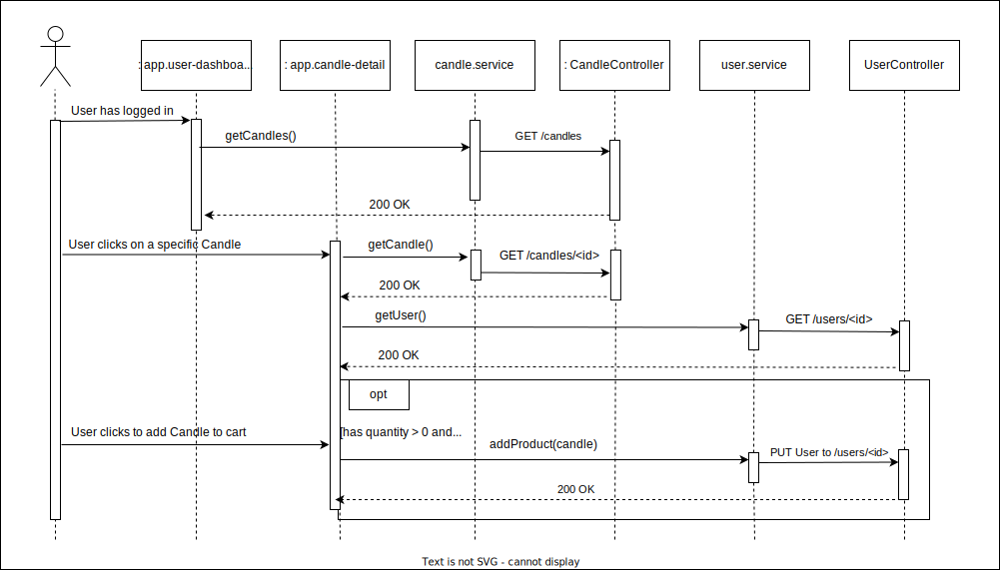

2. **Admin's update candle name:** On the admin's Candles page, a list of all the candles currently available for sale on the estore. Each candle in the list routes to the admin-detail component of the project which can be accessed by clicking on the candle. Once the admin reaches the admin-detail page, the current name, price and quantity of the candle is displayed on the screen using one-way binding calls to these attributes of the Candle class. Just below each of the current values of each property, the admin has the option to enter the updated version of the property (e.g., the updated name) and click on the "Update Name" button. This makes a call to the admin-detail component's editName() function which in turn calls the candle-service class's updateCandle() function. These calls update the name of the candle, which is reflected on the "Current name" section of the page immediately after clicking the "Update Name" button.

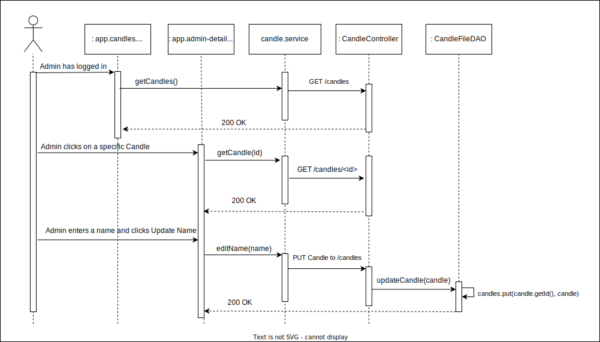
 
 

### **ViewModel Tier**

This tier is made up of the REST API Controller classes of the project. Here is a brief description of them:

* UserController: Sets up basic functions for user login and http CRUD call requests.
* CandleController: Sets up basic getters and setters for candle id, quantity, name and price, i.e., the CRUD operations for the Candle objects. It also contains functions for the "search" of a Candle.

  

The above diagram shows the UML class diagrams for the two Controller classes that make up this tier. The Controller classes specified above are the classes that are addressed to when the frontend code makes an HTTP call. The **UserController** class is called upon when a user tries to login to the estore. It sends over the current list of valid users to the frontend (using the getUsers() method) so that the frontend can decide if the username and password exists or not. In case the person logging into the estore needs to create a new account, the createUser() function needs to be called to create a new valid user. One thing to be checked while creating a new user is whether the username already exists or not. For this purpose, the searchUsers(String name) is used. The getUser(int id) function is used for various purposes throghout the frontend, including being able to display the correct saved shopping cart of the user, so that there is persistence of the shopping cart between login sessions. The addCreditCard() function is used, as the name suggests, to add a new credit card to the user's account.

The **CandleController** class contains fucntions that execute the CRUD operations for the candle objects. The admin uses the createCandle(), updateCandle(), and deleteCandle() functions while updating the inventory. The customer uses this class to view the list of all the available candles and to view the details of each candle that is for sale using the getCandles() and getCandle(int id) fucntions respectively. The searchCandles funtionality is used when the customer searches for a candle to add to their cart.

### Model Tier

The Model Tier represents the business logic, data access, and data manipulation components of the application. Its primary responsibility is to manage application data and enforce business rules. Thus this class is made up of POJOs (Plain Old Java Objects) like User, Candle and CreditCard classes. It also contains the DAO (Data Access Object) classes that are used to abstract and encapsulate access to the data in the POJO classes. Our Model inludes the interfaces UserDAO and CandleDAO and their implementations in the form of the classes UserFileDAO and CandleFileDAO. Here are short descriptions of each of them:

* UserDAO/UserFileDAO: Allows for users to be added to the estore and differentiates login of admin vs users.
* CandleDAO/CandleFileDAO: Allows for candles to be updated to an inventory.
* Candle: The basic creation of a candle with a name, id, price and quantity.
* User: The basic creation of a user with a required name/login, id and shopping cart.
* CreditCard: Used for creation of a credit card associated with a user (essentially a customer). It contains all the basic information about a normal credit card.

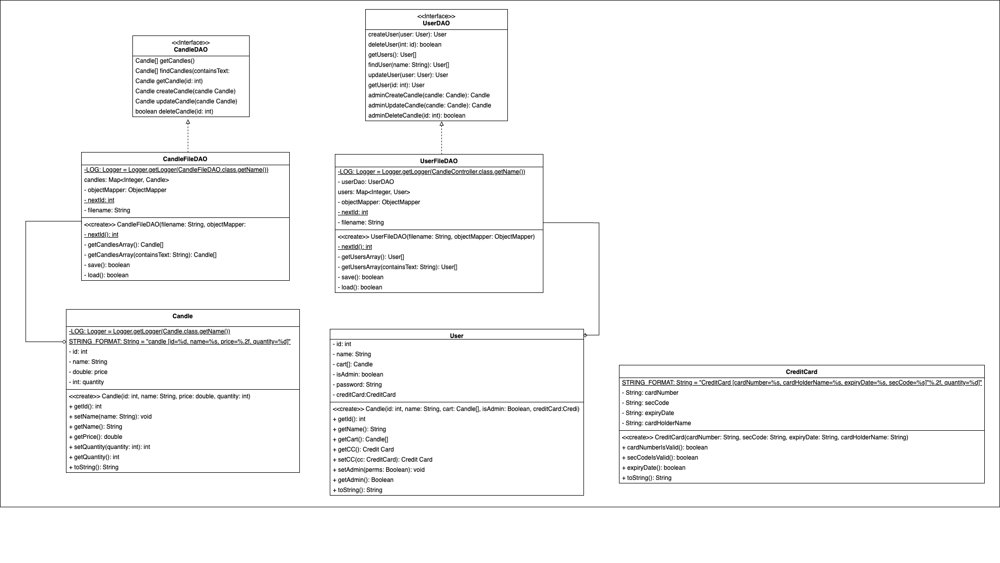

The User, Candle and CreditCard classes hold the attributes that are associated with each user, candle and credit card respectively. They also contain the getter and setter methods for these attributes, but nothing much other than that since they are only supposed to be used to represent entities or data transfer objects (DTOs) within an application (as per the definition of POJO).

The CandleDAO and UserDAO interfaces contain the basic functions that would be needed by the CandleFileDAO and UserFileDAO classes when they implement these interfaces. These interfaces are important in order to obey the OO principles of Low coupling, promotion of testability, and separation of concerns (Single Responsibility principle).

The UserFileDAO class contains the methods to get the next id for the creation of a new user, when a user wants to create a new account. It contains the getUsersArray() method to get wither all the users registered with the estore, or to get the users that have a certain string in their username. The save() function serializes the Java Objects of new Users created, to JSON objects into the file. The load() function deserializes the JSON objects from the file into an array of users.

The CandleFileDAO class also contains the nextId function used while creating a new candle by the admin. The getCandlesArray() does what the name suggests, and the save() and load() functions work essentially the same as the UserFileDAO class, but it serializes and deserializes the Candle array instead.

## OO Design Principles

We used OO principles from SOLID and GRASP including:
* Single Responsibility: Each class has one responsibility
* Open/Closed: Utilize inheritance and abstract classes to reduce complexity
* Dependency Inversion: Higher level models do not depend on lower level models
* Controller: A controller class is called to connect the front and back ends
* Information Expert: Effective and efficient method creation and naming
* Low Coupling: Assign class responsibility to remain at a low coupling
* Pure Fabrication: Limit the functionality of classes (similar to single responsibility)
* Law of Demeter: Create a direct relationship between classes (method naming)

**Controller Example:** In addition to our CandleContoller, there is a Controller class called UserController that allows for the connection between the frontend and backend of our e-store. A diagram in the section titled "ViewModel Tier", which is also under the Information Expert Example" section) showcases the controllers in this project.  These controllers will rely on a user’s action so that the Controllers can manage the direct flow of modifications to change the state of our Model, which in turn will alter our files in our storage system (the User and Candles JSON files), which will be shown on the frontend side.  Below is a sequence diagram (which is also in the "View Tier" section under the subsection "Specific Front-end Functionalities and Sequence Diagram") that showcases this example with adding a candle to the customer’s cart. In this example, it shows how when the user does an action on the website, the Contoller will execute the action (e.g. getting the list of candles that an estore made visible to the customer, and adding a specific candle to a user’s cart), and if done successfully, a HTTP code of 200 (OK) should be returned by the CandleController (to get the Candle) and the UserController to put the candle in the cart of the user who has logged in.

**Information Expert Examples:** Methods throughout our project are named in a specific way to indicate their responsibility in our e-store and what information they have access to. Such example in the UserController classes includes: “adminUpdateCandle()”, which is to indicate that only an admin has the capability to update the inventory and that they can use this function to update one candle at a time. This example makes it so that we don’t have to call call “isAdmin” and then “updateCandle()” in the Candle class for an admin to update a candle. A diagram in the section titled "ViewModel Tier" showcases the User and Candle controller classes, which is also shown below. As shown, the names of each function indicate their purpose in a way that doesn’t require developers to look at documentation to understand what a method is doing.

  

**Dependency Inversion Example:**  The CandleFileDAO class will inherit behaviors from the interface CandleDAO, which then will have those behaviors recognized and used by the Candle and CandleController. This can be seen with the diagram in the section titled "Model Tier". Below is a UML diaragram of the Candle-related classes only that will showcase Depenceny Inversion specifically as it is shown that the CandleDAO is the higher level module that has behaviors inherited an abstraction class, CandleFileDAO, which is then used by the Candle class.

  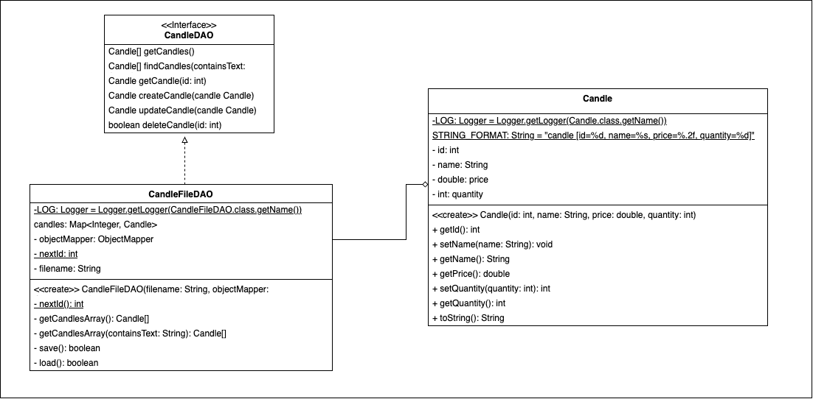

**Single Responsibility Example:** We have made separate classes/interfaces for each of the necessary components of our project, for example, we have three Model classes: User, CreditCard, and Candle. For a more specific example, using the UML digram for these classes and the interfaces for the Candle-related classes only as shown under the OO principal section for the “Dependency Inversion Example.” We see that that the CandleDAO file is responsible for establishing the behaviors that a Candle can have while the CandleFileDAO class implements the CandleDAO behavior. Then the Candle Class is responsible for storing information about an individual Candle so it can be used elsewhere in the project, such as the Candle Controller.

## Static Code Analysis/Future Design Improvements

Some issues with our code displayed by SonarQube are as follows:

* Updating a static variable in a non-static context
* Lack of assertions to a test method
* Passing concatenated strings into a logging method
* Including commented out lines of code

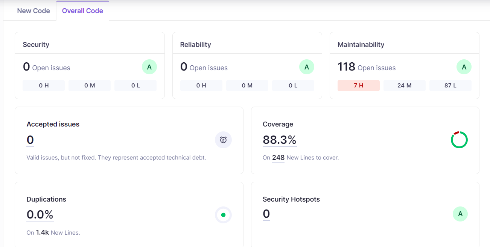

One key feature of adding a new product to the inventory is the incrementing of a variable labeled nextId. This variable is in a static context so that the ids can never be repeated, as that would create severe errors in our program. When incrementing this variable, however, we did not do it in static context, which is flagged as a severe error by SonarQube. An easy fix for this would be to make all methods including this variable in static context or synchronizing using a static context.

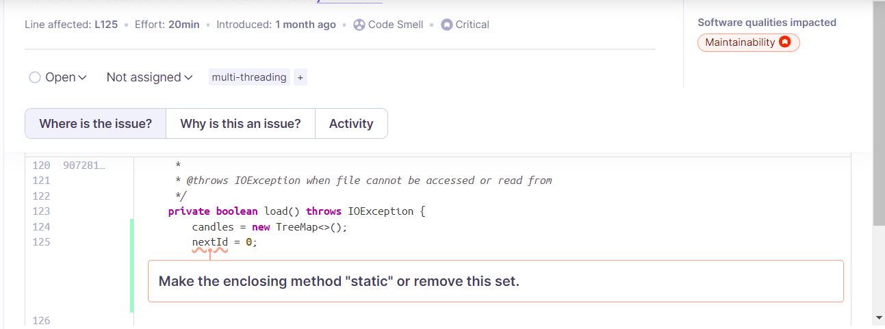

A provided method in our base file was used to test our CandlesApiApplication, however, the test file for this method was never written, meaning we have a blank test method with no assertion statements. If we were to read over the java class, it would be simple enough to write test cases using the same setup, invoke, analyze strategy for all of our other test files, eliminating this error.

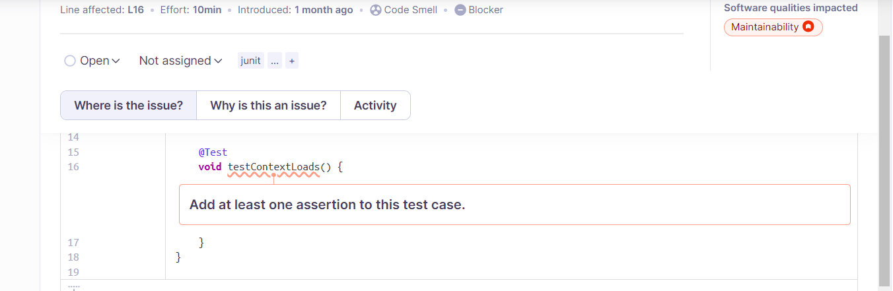

In many of our controller class methods, there is a method used called LOG.info(), which we assumed was necessary for the pathing of our website, as it was a feature of the starter code. However, when we expanded on this, SonarQube threw an error regarding string concatenation in this method, which is apparently an issue for the logger class. This could be fixed by adding certain pathing variables and reworking the current variables we have to the proper Spring Boot variables. (PathVariables vs RequestBodies).

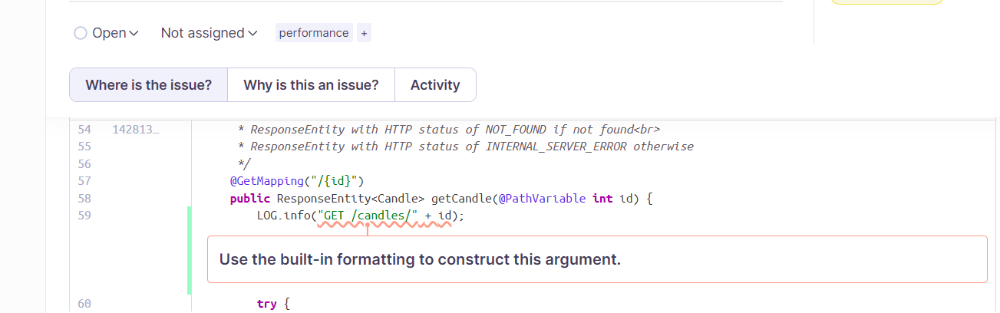

One minor issue flagged by SonarQube was the commented out lines of code that exist throughout our project. When we were testing our code manually, we would comment out lines of code that did not work as we expected and tried to rework the methods. However, when these solutions were eventually made, we never removed these commented out lines, which is a simple and straight forward fix.

### Future Refactoring/Other Design Improvements:

**Future Refactoring**

Some future refactoring we could've done involves cleaning up our code. While most of our classes and methods included JavaDoc comments, not all of them do. Similarly, some of our syntax is off in certain methods. Looking over every file to clean up our code by adding these comments, utilizing camel case, and other minor sytanx related issues would help create a polished project. Along with this, taking the issues pointed out by the Static Code Analysis would help us improve our project. Removing unneccesary methods and code from our program would create a more polished look, as well as making sure our variables are properly defined in static or non-static context. One of the major improvements we planned on adding but ran out of time for was CSS to make the view portion of our project look more polished and user friendly. Some of the names of various pages might seem unclear to new users, as well as the navigation between those pages, and with some minor CSS tweaks and additions, this would create a much more polished product.

A major issue in our 10% feature for adding a credit card, as pointed out by our Sprint 3 feedback and grade, was that a credit card does not properly save between pages. This issue seemed to only occur with the credit card, and most likely had to do with the use of a credit card class. This usability issue would be fixed if we had more time so users did not have to enter their credit card every time they went to buy their cart.

## Testing

**Testing**

Our backend code contains two major features that span across the controller, model and persistence fields, as well as an additional model field for a 10% feature we added. These are our candle classes, user classes and the credit card class. Each class has their own test files which test each individual method using mockito to create mock versions of our DAOs. Each method in the model class is tested, excluding getters and setters, as well as a test for the toString() method which we overrode in each model class. Our DAO methods are being tested for each method excluding the load() and save() methods. Our controller classes have the most extensive tests as each case must be checked for each method in the class. For instance, when creating a new candle, there are multiple cases to check including it succeeding and creating a candle, it failing and returning a conflict if the candle was already existing, or it failing and returning an internal server error. This is replicated for all methods in all of our Java classes.

### Acceptance Testing
All of our implemented user stories have passed all of their acceptance tests.

However, leading up to this point we had many issues implementing our shopping cart and having it persist between logging in and out as a user. We originally had a shopping cart class in our model tier that we planned to implement in our user class that is also currently in the model tier. However, we decided to make the shopping cart an array of candles so it would be easier for us to write the code individually and review it afterwards. We ran into issues regarding this topic for similar pieces later on in the project.

Similar to the shopping cart issues, we had issues implementing the credit card class for our 10% enhancement, especially regarding the persistence between login attempts. We did not get this fixed completely by the end of Sprint 3, but we had a functional credit card which worked each time someone logged in, despite not persisting between relogging in as that user at a later time.

Overall, when filling out our acceptance test plan towards the end of Sprint 3, we found it fairly easy to pass every test as we periodically tested our code via the acceptance criteria throughout the completion of the project.

### Unit Testing and Code Coverage

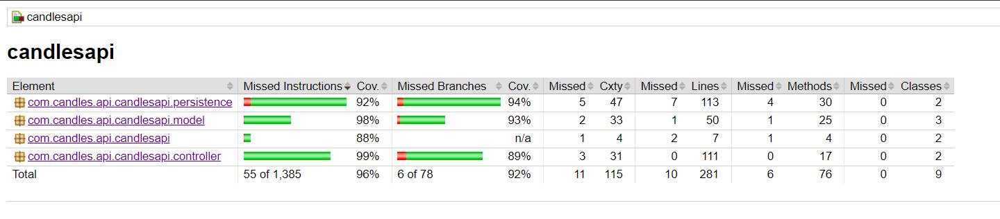
We wrote unit tests for each of the Java classes and required that all of them succeeded. We used Mockito mock Java objects to test our classes and aimed for a target total code coverage of 90%. This target coverage indicates that we are confident that our classes are working as they were designed to.

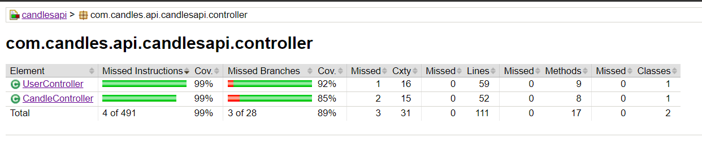
Looking at our controller tier, both the CandleController and UserController are being tested for the most part. The minor issues in these classes that result in the coverage being an 89% are both in the createCandle and createUser methods. The tests we wrote for these only seem to test if the candle creation or user creation succeeds, and does not necessarily handle any exceptions.

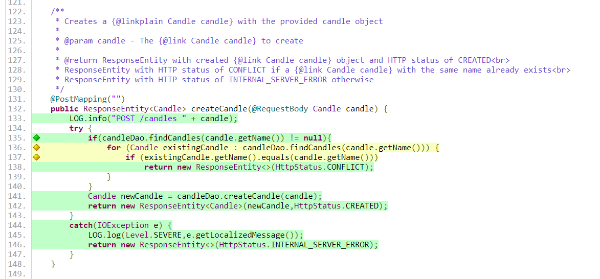
Furthermore, this example in our CandleController class shows the failure to test all cases in the yellow flagged section, which ends up checking if there is a conflict. We ran into an issue testing this as the specific line to test for a conflict is flagged as green, which means we have a method in our testCandleController class to check for a conflict when creating a candle. However, the issue arose before line 138 in our code, meaning the error is within the for loop and if statement, which we were unable to find.

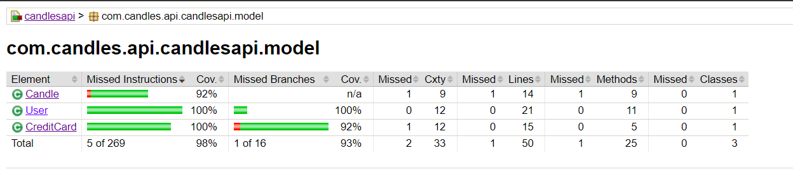
As shown in our model tier, most of the three classes are tested with 100% coverage. The only exception is the CreditCard class, which we had to code in the last couple of days of Sprint 3. Because of this time constraint, we were unable to fully check our code coverage of this class, leaving us with less coverage for it.

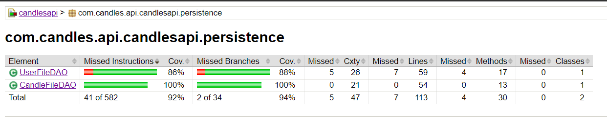
In our persistence tier, the CandleFileDAO is tested completely, however, the UserFileDAO is only at 88% coverage. This is due to the implementation of some unused methods in our code. We originally assumed we would need methods to test if the user was an admin or not, while our actual implementation on the front end simply checked if the username was "admin", then set a boolean variable called isAdmin to true.

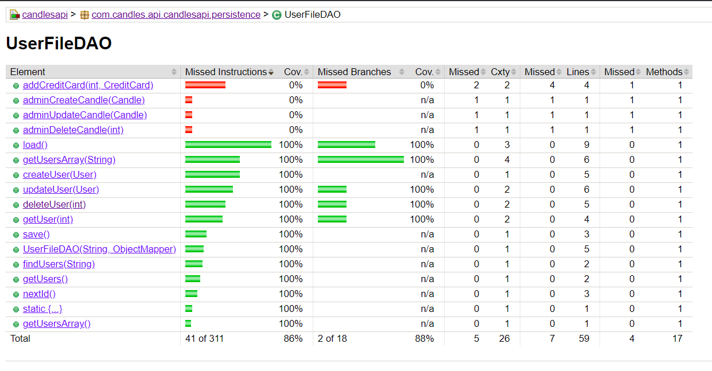
As seen in the UserFileDAO analysis by JaCoCo, there are four methods at the top which were meant to perform specific actions that are exclusive to an admin of the estore. However, once we began to work on the front end of this project, we realized we did not need all of these methods as they can be called from the CandleFileDAO after checking if a given users isAdmin boolean property was set to true. If not, they would not be able to perform these actions, rendering these methods useless, but we did not end up removing them, which in hindsight would've been a better choice.

Overall, our JaCoCo code coverage report generated a coverage of 92% of our code, which was enough to hit the requirement on the rubric for this course. Despite this, there are many minor issues (as mentioned above) that could be resolved after analyzing this report if we had more time to work on our project.

## Ongoing Rationale

(2024/04/04): Sprint 3: After having our ten percent features (which were Product Review and Account Information) approved on 2024/01/30, We decided to change Product Review to add a Password feature upon login. This was done so that we would more easily be able to implement the feature within our existing structure and the timeframe that we had.

(2024/04/04): Sprint 3: After working on our ten percent feature for Account Information, we could not complete the full extent to what we had planned. We still have a feature that can add a credit card, but no billing/shipping address information added.
